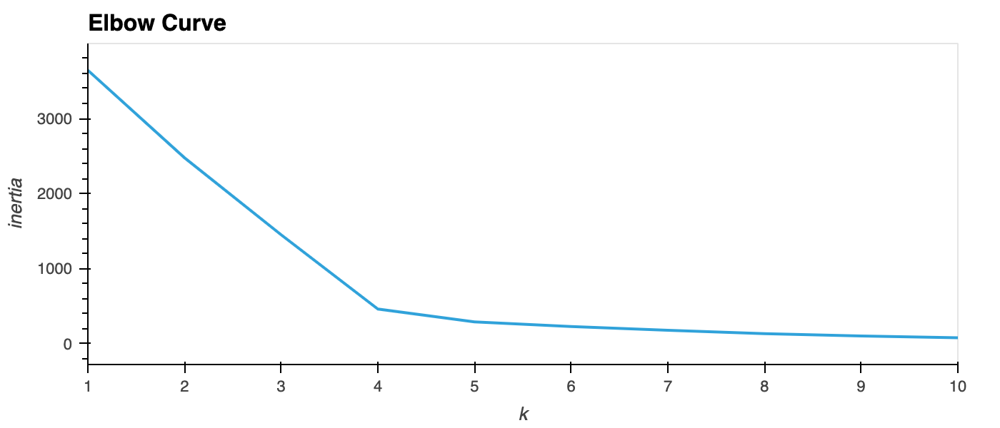
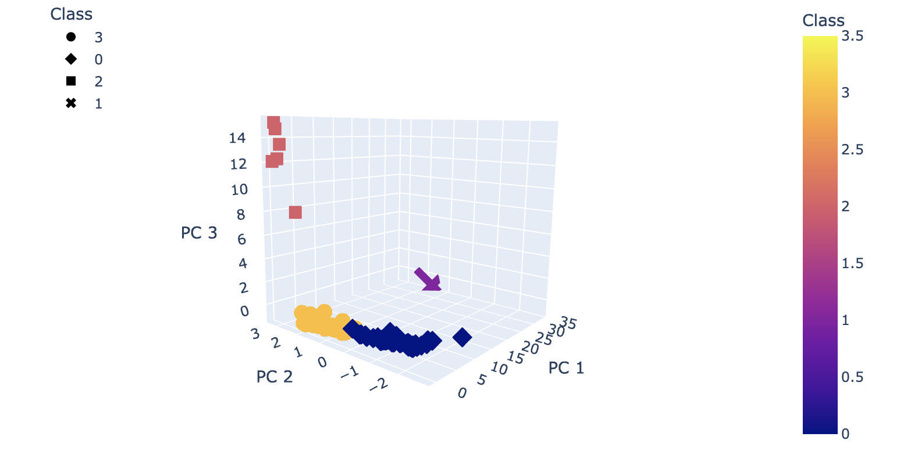
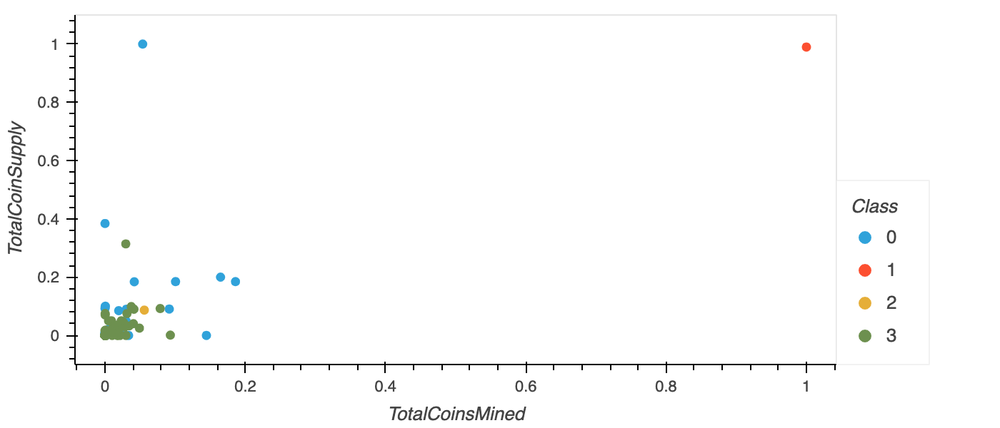

# Cryptocurrencies

The goal fo the analysis is to understand what cryptocurrencies are on the trading market and how they could be grouped to create a classification system for this new investment.

In summary, there are 532 tradable cryptocurrencies. Principal Component Analysis (PCA) algorithm was applied and the dimensions was reduced to three principal components. 

Elbow curve showed the best value for K is four. 

K-means algorithm was used to cluster the four cryptocurrencies clusters using the PCA data.

For visualization, we created scatter plots with Plotly and hvplot to show the total coin supply against total coin mined, in distinct groups that correspond to the three principal components. 

A table with all the currently tradable cryptocurrencies was created using the hvplot.table() function.

